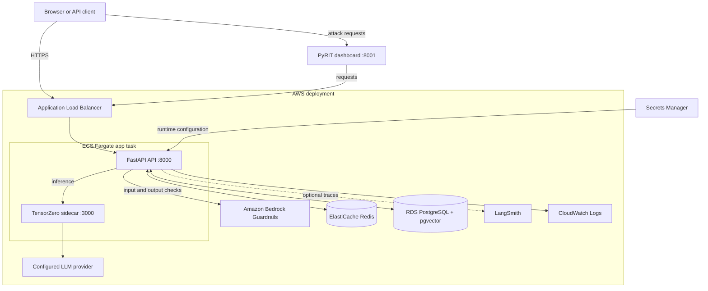
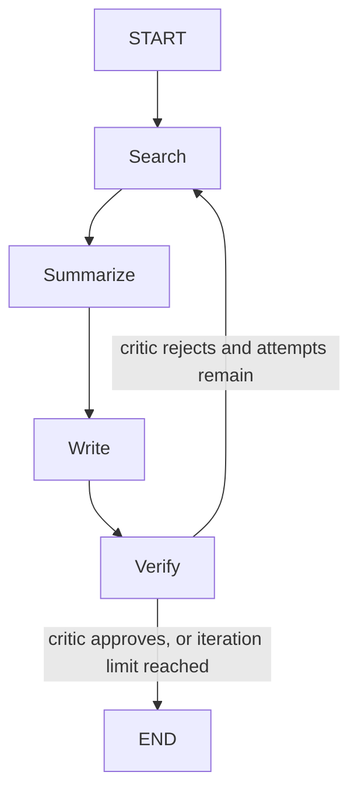

# Multi-Agent AI Research Platform

A FastAPI application that produces structured research reports through a LangGraph workflow, with TensorZero-backed model inference, AWS Bedrock safety checks, session and long-term memory, and an accompanying PyRIT red-team dashboard.

[Watch the demo video](https://youtu.be/zbdH9H5SBDI)

## Overview

The API accepts a research topic, validates it with Amazon Bedrock Guardrails, queues a job in Redis, and runs a four-stage agent workflow: search, summarize, write, and critique. Completed reports can be retrieved as text, JSON, or PDF. The service persists short-lived conversation history in Redis and stores report embeddings in PostgreSQL with pgvector to reuse closely matching work and provide related-report context.

The repository also contains a separate FastAPI-based PyRIT dashboard for running and inspecting red-team prompts against the research API.

## Key capabilities

- LangGraph workflow with `SearchAgent`, `SummarizeAgent`, `WriterAgent`, and `CriticAgent`.
- TensorZero gateway calls for the `research_summarize` and `report_write` functions.
- Amazon Bedrock Guardrails applied to both submitted topics and generated reports.
- Redis Streams job queue, result storage, per-IP rate limiting, session history, and semantic cache.
- PostgreSQL/pgvector long-term report memory, related-report context, and report diffs.
- Optional LangSmith tracing and LLM-based report evaluation.
- Text, JSON, and PDF report outputs.
- PyRIT dashboard for jailbreak, XPIA, Crescendo, and Skeleton Key attack scenarios.
- Terraform and GitHub Actions configuration for AWS ECS/Fargate deployment.

## Architecture



### What each layer does

1. **Ingress and user interfaces.** The browser UI is served by the research API. Terraform also configures an Application Load Balancer in front of the ECS services. The PyRIT dashboard is a separate service that sends its test requests to the target API.
2. **API and request protection.** `POST /research` optionally authenticates the `X-API-Key`, enforces the per-IP Redis-backed rate limit, then calls Bedrock Guardrails on the submitted topic. Unsafe input is rejected before a job is created.
3. **Asynchronous work.** Accepted requests are added to a Redis Stream. The API process starts a worker loop at application startup, consumes the stream through a Redis consumer group, and writes a temporary result record keyed by job ID.
4. **Memory and reuse.** Before invoking agents, the worker checks a Redis semantic cache. On a cache miss it searches previous reports in PostgreSQL/pgvector. A close match can be reused; a related report can be supplied to the writer as context.
5. **Research workflow.** A LangGraph state machine invokes the four agents below. Each calls TensorZero’s `/inference` endpoint. The critic can send the graph back to search for another pass.
6. **Model gateway.** In ECS, TensorZero runs in the same task as the FastAPI container, so the API connects to `http://localhost:3000`. TensorZero selects the configured provider/model and applies the repository’s MiniJinja system templates.
7. **Result protection and delivery.** The service runs Bedrock Guardrails against the completed report. Approved content is cached, retained as session history, stored in long-term memory, and made available as text, structured JSON, or a generated PDF. Blocked output and processing failures are represented as distinct result states.
8. **Operations.** Terraform supplies CloudWatch log groups and optional LangSmith tracing. AWS Secrets Manager provides the runtime configuration; no application secret values are stored in this repository.

### Research execution flow



The graph increments its iteration count after each write. A critic rejection routes back to search while the count is below `AGENT_MAX_ITERATIONS`; the configured default is `2`.

### Agent responsibilities

| Agent | Input | Work performed | Output |
| --- | --- | --- | --- |
| `SearchAgent` | Topic and up to four recent session messages | Requests five key facts, developments, and relevant details. | Research findings. |
| `SummarizeAgent` | Search findings | Condenses findings into structured bullet points. | Summary. |
| `WriterAgent` | Topic, summary, and optional related report | Produces the report with Executive Summary, Key Findings, Analysis, and Conclusion. | Draft report. |
| `CriticAgent` | Truncated draft report | Requests a factual-consistency and logical-coherence verdict. | Approval or rejection. |

## Components

| Component | Responsibility |
| --- | --- |
| `app/main.py` | FastAPI app, lifecycle management, endpoints, worker loop, job processing. |
| `app/agents.py` | LangGraph state graph and the research, summary, writer, and critic agents. |
| `app/guardrails.py` | Applies Bedrock Guardrails to input and output. |
| `app/cache.py` | Redis semantic cache using `all-MiniLM-L6-v2` embeddings. |
| `app/memory.py` | Redis session history and PostgreSQL/pgvector long-term report memory. |
| `app/queue.py` | Redis Streams enqueue, consume, acknowledge, and result helpers. |
| `app/eval.py` | Per-report and batch LLM evaluation helpers, with LangSmith datasets when configured. |
| `tensorzero/` | TensorZero configuration, templates, and gateway image. |
| `pyrit_dashboard/` | Separate FastAPI PyRIT red-team dashboard. |
| `terraform/` | AWS infrastructure definitions. |

## Technology stack

- Python 3.11 or later, FastAPI, Uvicorn, Pydantic
- LangGraph and LangChain Core
- TensorZero
- Redis and Redis Streams
- PostgreSQL with the `vector` extension, `asyncpg`, and `sentence-transformers`
- Amazon Bedrock Guardrails, AWS Secrets Manager, ECS/Fargate, ECR, ElastiCache, RDS, CloudWatch, and Application Load Balancer
- PyRIT 0.14
- Terraform and GitHub Actions

## Prerequisites

- Python 3.11+
- `uv` (the application Docker image uses it, and `uv.lock` is committed)
- AWS credentials that can read the `research-agent/config` secret and call Bedrock Guardrails
- Redis, PostgreSQL with pgvector, and a reachable TensorZero gateway
- A configured TensorZero model-provider credential (the supplied Terraform passes a Groq credential to the TensorZero sidecar)

The application loads its runtime configuration only from AWS Secrets Manager. This repository does not include a `.env.example`, Compose file, or a local service bootstrap, so a fully local runtime requires provisioning those dependencies and the expected secret outside this repository.

## Installation and local launch

Install the locked project dependencies:

```powershell
uv sync
```

Make the `research-agent/config` secret available in the selected AWS region. At minimum it must supply:

```text
BEDROCK_GUARDRAIL_ID
BEDROCK_GUARDRAIL_VERSION
REDIS_URL
DATABASE_URL
TENSORZERO_URL
```

`API_KEY` is optional; authentication is disabled when it is empty. See [Configuration](#configuration) for the additional supported settings.

Launch the research API from the repository root:

```powershell
uv run uvicorn app.main:app --host 0.0.0.0 --port 8000
```

The root page serves `index.html`. When accessed on `localhost`, the UI calls `http://localhost:8000`; when hosted elsewhere it uses the current origin. It stores the entered API key in the browser.

Run the PyRIT dashboard separately:

```powershell
uvicorn main:app --host 0.0.0.0 --port 8001
```

Run this command from `pyrit_dashboard/` after installing its dependencies:

```powershell
pip install -r requirements.txt
```

The dashboard uses `TARGET_URL` (default: `http://app:8000`) and optional `REDIS_URL` environment variables.

## Configuration

`app/config.py` obtains one JSON object from AWS Secrets Manager (`research-agent/config`) in `AWS_REGION` (default `us-east-1`). Required values are listed below; all remaining values have code defaults.

| Setting | Required | Purpose / default |
| --- | --- | --- |
| `BEDROCK_GUARDRAIL_ID` | Yes | Bedrock Guardrail identifier. |
| `BEDROCK_GUARDRAIL_VERSION` | Yes | Bedrock Guardrail version. |
| `REDIS_URL` | Yes | Redis connection string. |
| `DATABASE_URL` | Yes | PostgreSQL connection string. |
| `TENSORZERO_URL` | Yes | TensorZero gateway base URL. In the ECS task definition, this is `http://localhost:3000` because the gateway is a sidecar in the same task. |
| `API_KEY` | No | Enables `X-API-Key` authentication when non-empty. |
| `LANGSMITH_API_KEY` | No | Enables LangSmith tracing when non-empty. |
| `LANGCHAIN_PROJECT` | No | LangSmith project; default `research-agent`. |
| `LANGSMITH_DATASET` | No | LangSmith dataset; default `research-agent-reports`. |
| `CACHE_TTL`, `CACHE_SIMILARITY_THRESHOLD` | No | Semantic cache TTL and threshold; defaults `3600`, `0.85`. |
| `SESSION_TTL`, `SESSION_MAX_MESSAGES`, `SESSION_CONTENT_TRUNCATE` | No | Session settings; defaults `1800`, `5`, `500`. |
| `LTM_DAYS`, `LTM_THRESHOLD`, `LTM_DIFF_LIMIT`, `IVFFLAT_LISTS` | No | Long-term memory and pgvector index settings; defaults `7`, `0.88`, `5`, `100`. |
| `STREAM_KEY`, `CONSUMER_GROUP`, `CONSUMER_NAME`, `RESULT_TTL` | No | Redis job queue settings; defaults `research:jobs`, `workers`, hostname, `3600`. |
| `AGENT_REPORT_TRUNCATE`, `AGENT_MAX_ITERATIONS` | No | Critic input truncation and maximum write iterations; defaults `3000`, `2`. |
| `EVAL_REPORT_TRUNCATE`, `EVAL_COMMENT_TRUNCATE` | No | Evaluation truncation settings; defaults `1500`, `300`. |
| `LLM_MAX_RETRIES`, `LLM_RETRY_DELAY` | No | Retry settings; defaults `3`, `1.0`. |
| `RATE_LIMIT_REQUESTS`, `RATE_LIMIT_WINDOW` | No | Per-IP research rate limit; defaults `10`, `60` seconds. |
| `DB_POOL_MIN`, `DB_POOL_MAX` | No | PostgreSQL connection-pool bounds; defaults `2`, `10`. |

Keep credentials out of source control. Terraform marks its API and provider-key inputs as sensitive; pass them as Terraform variables or through your secret-management workflow.

## API reference

Protected endpoints require `X-API-Key` only when `API_KEY` is configured.

| Method | Path | Description |
| --- | --- | --- |
| `GET` | `/` | Serves the browser UI. |
| `GET` | `/health` | Returns service status and Redis connectivity. |
| `POST` | `/research` | Validates and queues a research job. Rate limited per client IP. |
| `GET` | `/result/{job_id}` | Returns `pending`, completed output, blocked, or error state. |
| `GET` | `/result/{job_id}/pdf` | Downloads a completed report as a PDF. |
| `GET` | `/session/{session_id}` | Returns stored session messages. |
| `GET` | `/diff/{topic}` | Returns a diff between the two newest reports for the topic, if available. |
| `GET` | `/stats` | Returns Redis statistics plus TensorZero URL and guardrail ID. |
| `GET` | `/evaluate/{job_id}` | Runs report evaluation for a completed job. |
| `POST` | `/run-evaluation` | Starts a background batch evaluation for supplied or recent topics. |

### Submit and retrieve a job

```bash
curl -X POST http://localhost:8000/research \
  -H "Content-Type: application/json" \
  -H "X-API-Key: $API_KEY" \
  -d '{"topic":"What is AI?","output_format":"text"}'
```

The request body accepts `topic` (required), `session_id` (optional), and `output_format` (the UI offers `text`, `json`, and `pdf`). A successful submission returns a generated `job_id` and `session_id`. Poll `GET /result/{job_id}` until the response is no longer `{"status":"pending"}`.

`POST /research` may return `400` for guardrail-blocked input, `401` for an invalid or missing configured API key, or `429` for a rate-limited client. `GET /result/{job_id}/pdf` returns `404` until a job is complete.

## Safety, reliability, and observability

- Bedrock Guardrails validate both input topics and final report content. The Terraform policy configures high-strength filters for hate, violence, sexual content, insults, misconduct, and prompt attacks, as well as deny topics for weapons, illegal activity, and self-harm.
- The service retries guardrail and model gateway calls with exponential backoff. TensorZero HTTP diagnostics are truncated and redact common credential fields before logging.
- A failed job is stored as an `error` result; output blocked by the guardrail is stored as `blocked`.
- The API emits JSON-formatted application logs. Terraform configures CloudWatch log groups for the app, TensorZero sidecar, and PyRIT dashboard.
- When `LANGSMITH_API_KEY` is present, LangSmith tracing is enabled for the agent and evaluation paths.

The implementation does not make a guarantee that every unsafe or adversarial request will be blocked. The PyRIT dashboard’s “passed” and “blocked” states are test outcomes, not a security certification.

## Screenshots

### Research UI: guardrail enforcement


### Session history


### PyRIT red-team dashboard


### ECS deployment


## Containers and AWS deployment

`app/Dockerfile` builds the repository root with Python 3.11 and starts the API on port `8000`. `tensorzero/Dockerfile` builds the TensorZero gateway image, which binds to port `3000`. `pyrit_dashboard/Dockerfile` builds the separate dashboard and starts it on port `8001`.

Terraform provisions the AWS deployment components represented in `terraform/main.tf`, including VPC networking, an Application Load Balancer, ECS/Fargate task definitions and services, ECR repositories, ElastiCache Redis, RDS PostgreSQL, Secrets Manager, CloudWatch log groups, Bedrock Guardrails, IAM roles, and CPU-based auto-scaling for the research app. The research ECS task places the API and TensorZero containers together, which is why the service uses `http://localhost:3000` for its gateway.

To initialize the configured remote Terraform state, first create its S3 bucket and DynamoDB lock table with:

```bat
bootstrap.bat
```

Then review the plan and apply it from `terraform/` with the required image and secret inputs:

```powershell
terraform init
terraform plan
terraform apply
```

The repository’s GitHub Actions workflow builds and pushes the app, PyRIT, and TensorZero images to ECR on pushes to `main`, then updates or creates the ECS services. It requires repository secrets named `AWS_ACCESS_KEY_ID` and `AWS_SECRET_ACCESS_KEY`; its deployment process waits for app-service stability and contains rollback steps for both app and PyRIT service deployments.

## Testing

No automated test suite is present in the repository. The PyRIT dashboard is the included security-test interface; it is not a replacement for unit or integration tests.

## Known limitations

- There is no checked-in local Compose configuration or example Secrets Manager payload.
- `Config` fetches AWS Secrets Manager during module import, so the API cannot start without AWS access and a readable runtime secret.
- The Redis Streams worker runs in-process. Redis pending-message recovery is not implemented in the repository.
- Semantic-cache lookup scans stored embedding keys, which should be considered when sizing a Redis deployment.
- The repository has no automated tests or CI validation workflow beyond deployment.

## Project structure

```text
app/                 Research API, agents, persistence, guardrails, and Docker image
pyrit_dashboard/     PyRIT red-team dashboard and Docker image
tensorzero/          TensorZero gateway configuration and prompt templates
terraform/           AWS infrastructure
docs/images/         README screenshots
.github/workflows/   ECS deployment workflow
```
